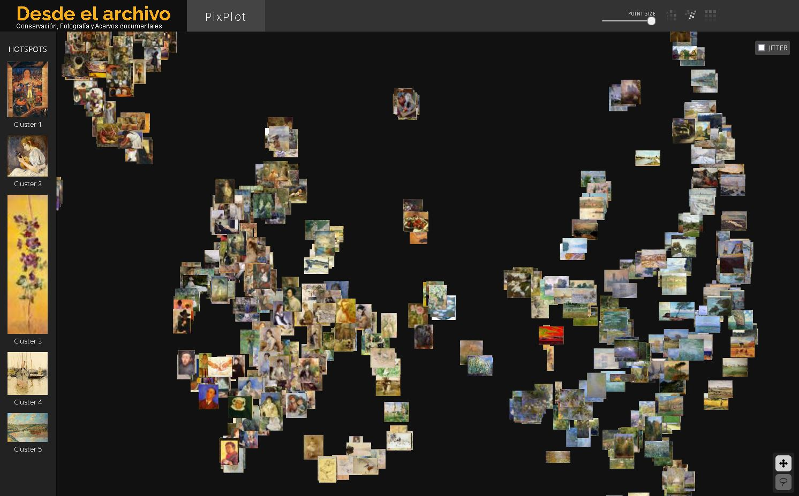

# 🖼️ pixplot-wikiart

## [🔗 visitar la página](https://gustavolsj.github.io/pixplot_wikiart/#)

## ✔️ Descripción

Muestra el resultado de la aplicación de [Pixplot](https://github.com/YaleDHLab/pix-plot) a una pequeña muestra del conjunto de datos [wikiart](https://www.wikiart.org/es)

## ⚙️ Funcionamiento

Pixplot fue desarrollado por el Laboratorio de Humanidades Digitales de la Universidad de Yale, permite agrupar imagenes dentro de un espacio bidiminesional con base en su semejanza visual. Su instalación y uso es muy sencillo, y el resultado es un sitio HTML estatico pero interactivo, opera con python y tensorflow.

Wikiart es una encyclopedia de arte de todos los periodos y regiones, contiene informacion de 160 mil obras categorizadas por autor, estilo, periodo y género. Existen diversos conjuntos de datos con las imagenes de estas obras que se pueden utilizar para experimentos de Inteligencia Artificial
